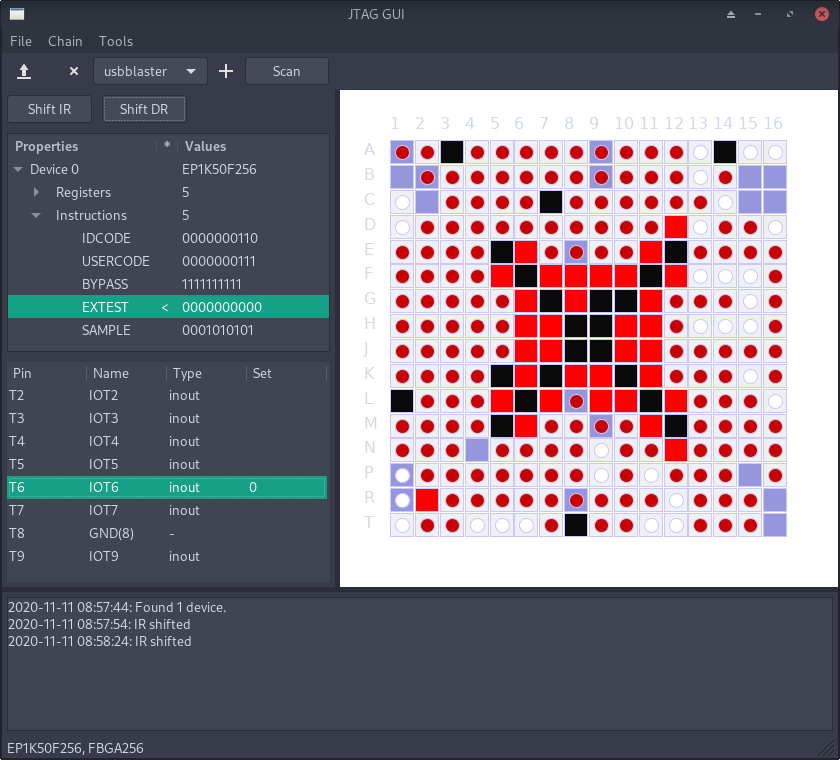

## Updates

### Update 23/11/21

- Added dragging to pin panel;
- Improved zooming;

### Update 22/04/21

- Refactored `DUT` (Device Under Test) class creating a more logical structure. Avoids working directly with BSDL AST dictionaries;
- Added pin numbers to QFL packages;
- Added zoom using mouse scrollbar to package plots;
- Moved BDSL parser initialization to start only when needed. Shortens application run time;
- Importing bad BSDL files gives an error message in the log frame.

## JTAGViewer

This code presents an approach to combine 3 tools into a JTAG test chain visualizer.

* [UrJTAG](http://urjtag.org/) Python bindings for hardware backend;
* [TatSu](https://tatsu.readthedocs.io/en/stable/) grammar parser for parsing external BSDL files. This software uses BSDL grammar definition from [cyrozap/python-bsdl-parser](https://github.com/cyrozap/python-bsdl-parser);
* [wxPython](https://www.wxpython.org/) for GUI interface.

Current version allows for BSDL parsing and saving into an SQLite DB, device detection, pin mapping, SAMPLE instruction BSR reading and simple pin state setting.

Example of the program running on a real device below:

This is just a demo for now. I will continue to add new features, so that I have a tool that is useful for my own work.

### Installation and running

This software was developed under Python 3.9. And uses the mentioned above packages (wxPython, TatSu and UrJTAG Python bindings). For now it works just by running `main.py`.

By default GUI needs UrJTAG, but passing `DEBUG` as command argument runs a UrJTAG mock class for debuging.

I used it together with a STM32 USBBlaster clone (e.g. [DirtyJTAG](https://github.com/jeanthom/DirtyJTAG)) for interfacing with JTAG, but any of the probes supported by UrJTAG should work. The dropdown list allows to select a probe as listed in the `help cable` listing in UrJTAG.

Device discovery is based on BSDL files that are parsed and saved in local SQLite DB. They can be added and removed to the repository accessible in the `Tools` menu.

### Viewing and setting pins

By default the instruction register (IR) is set to BYPASS. If you want to view and set the pins, you should set the IR to SAMPLE.

You can do this by double clicking on the SAMPLE instruction. The instruction is ready to be loaded into the IR (which is indicated by the '<' mark). You then shift the instruction by clicking the 'Shift IR' button (also with '<' indicating that an instruction is ready to be loaded). You should be able to access the BSR register now, showing pin status after shifting DR, by clicking the 'Shift DR' button.

To enable auto-refresh click 'Chain', then select the refresh period in the 'DR auto update' submenu.

## Discalimer

Still this is not any kind of production software, only a demonstration with shameful amount of hackery. It's been tested with limited number of devices and only one JTAG cable. Thus it will undergo changes and refinements.

I kindly appreciate suggestions and finding any mistakes. 

I do not take any responsibility for this software nor any potential damage it causes. Use it on your own responsibility.